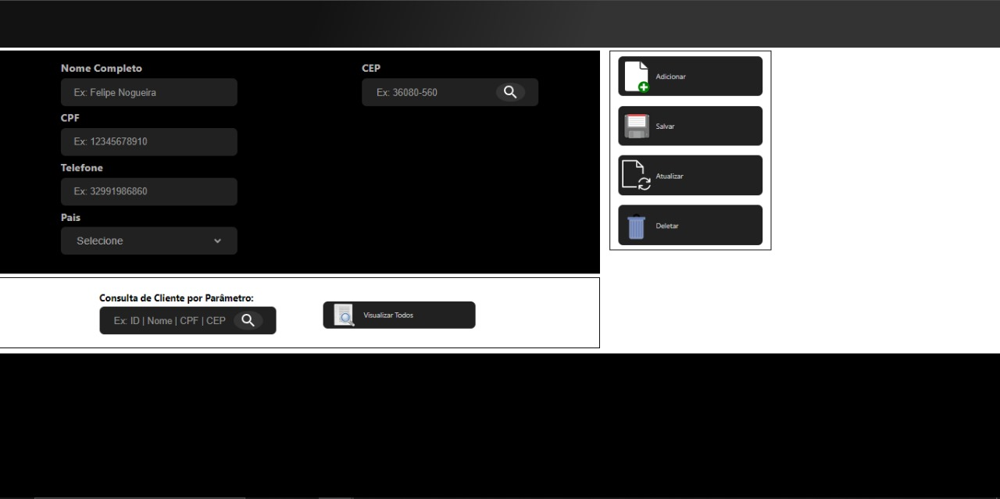
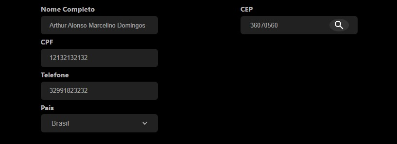
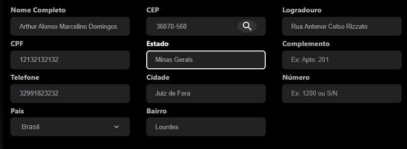
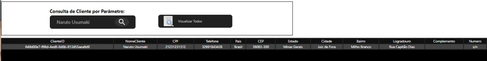

# Gerenciamento-de-Infomacoes-Frotend

## Introdução
Este projeto, como parte adjascente e complementar ao proejeto do repositório de nome Gerenciamento-de-informacoes-Backend, possui a responsabilidade de consumir e acessar a API desenvolvida no repositório citado e diante disso, trasformar o manuseio das informações do Banco de Dados em algo descomplicado e visualmente entendível. Desenvolvi esse projeto no intuito de resolver um problema pessoal,relacionado a minha loja em desenvolvimento e por causa disso surgiu a necessidade de criar uma interface que facilitaria o gerenciamento de informações dentro do meu Banco de Dados, por isso surgiu este projeto.

## Aspectos Técnicos 
Este projeto foi desenvolvido utilizando a biblioteca de criação de interfaces de usuário a partir da utilização de componentes em Javascript, a biblioteca React. Com ela foi possível criar uma única interface com diversas funcionalidades que, em conjunto, modificam a interface de forma dinâmica para oferecer informações instantâneas.
Na Primeira versão desse projeto há as seguintes funcionalidades: Adicionar, Salvar, Deletar, Pesquisar por Parâmetros e Atualizar, todas referentes a Entidade ou Tabela Clientes dentro do Banco de Dados.
Além de utilizar a minha própria API, utilizei também para a inserção de dados pessoais de cliente a Api da ViaCEP, para fazer consulta, validação e prenchimento automático de endereços.
Um dos pontos principais além do visual desse projeto é o tratamento de dados que torna o gerenciamento de informações indubitável, já que o sistema alerta á erros de todos os âmbitos, com uma checagem elegante que visa a diminuição da complexidade ciclomática do código, mesmo sendo um projeto relativamente maior que os comuns.

## Screenshots da Interface
### Primeiro Acesso:

### SectionForm:
#### Área dedicada a inserção de informações, inicialmente:

#### Área dedicada a inserção de informações,posteriormente:

### SectionActions:
#### Área dedicada a botões que desempenham funções:

### SectionConsult:
#### Área dedicada a realização de consultas ao banco de dados e retorno de informações:

### VisualTable:
#### Área dedicada a visualização de informações:

